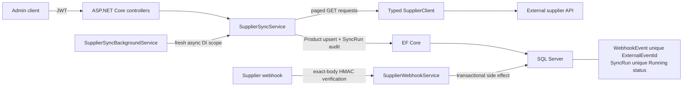
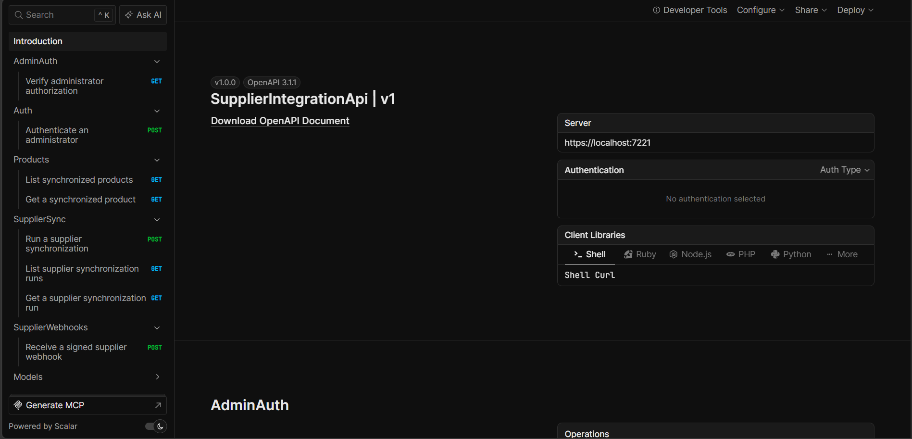
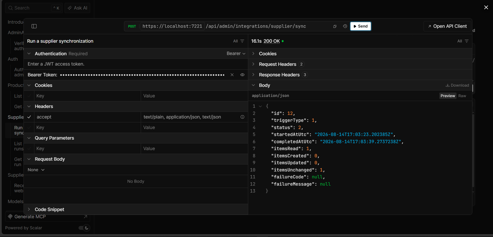
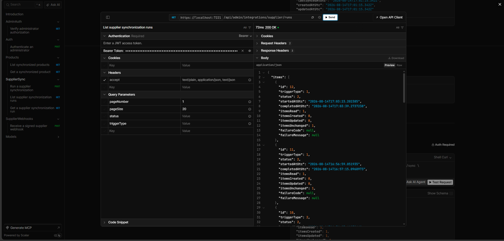
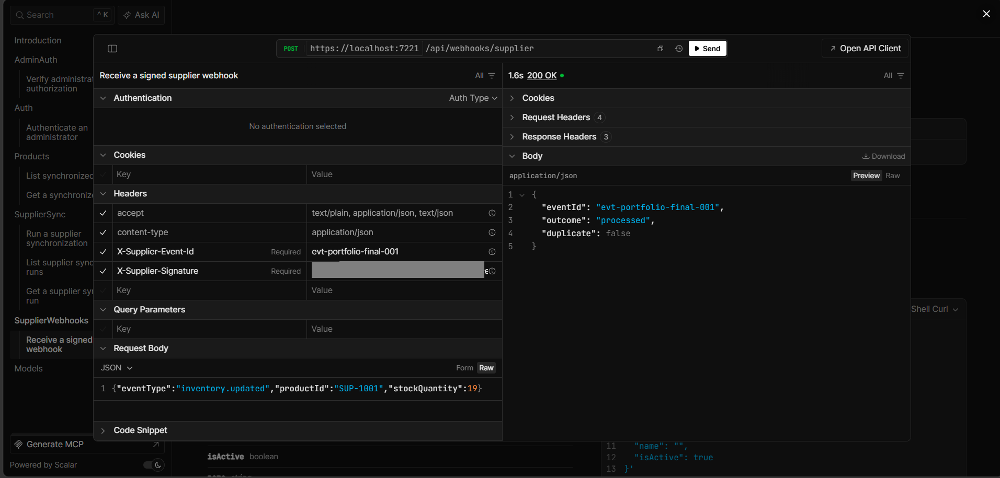
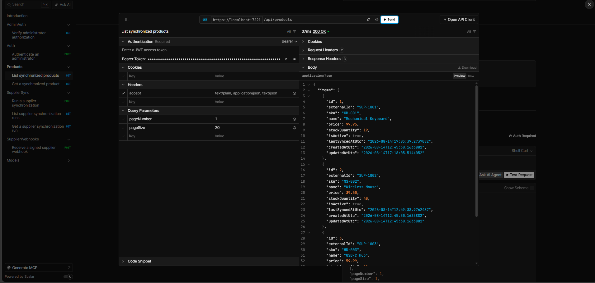

# ASP.NET Core Supplier Integration & Webhook API

Backend integration service built with ASP.NET Core for synchronizing external supplier data, processing secure idempotent webhooks, handling resilient HTTP communication, and maintaining auditable synchronization history. This is a focused backend integration portfolio project rather than a general-purpose commerce system.

## Portfolio highlights

- Third-party REST API integration through a typed `HttpClient`, validated pagination, and product upsert
- Finite resilience pipeline: one initial request plus three retries, 200 ms constant base delay, bounded timeouts, transient connection/408/429/5xx handling, and `Retry-After` support
- JWT Admin authentication and authorization with SQL Server/Entity Framework Core persistence
- Auditable manual and scheduled `SyncRun` history with a database-backed one-active-run rule
- HMAC-SHA256 webhooks over exact raw bytes, constant-time comparison, 64 KiB limit, and database-backed idempotency
- Concurrent duplicate-delivery protection, safe Problem Details, liveness/readiness checks, OpenAPI/Scalar, and relational integration tests

The central integration story is that unreliable supplier HTTP communication and repeated webhook delivery are handled without duplicating local business side effects.

## Technology stack

.NET 10, ASP.NET Core 10, C#, EF Core 10, SQL Server, JWT Bearer authentication, typed `HttpClient`, framework HTTP resilience, FluentValidation, ASP.NET Core Health Checks, built-in OpenAPI, Scalar, xUnit, `WebApplicationFactory`, and SQLite for relational integration tests.

## Architecture



The remote download is not held inside a long SQL transaction. Supplier pages are fetched and validated first; local persistence uses the existing short database workflow.

## Supplier synchronization workflow

```text
manual or scheduled trigger
  -> claim the one Running SyncRun in the database
  -> fetch and validate every supplier page
  -> upsert Products by ExternalId
  -> finalize counts and SyncRun status
```

Manual and scheduled triggers call the same `SupplierSyncService`. The manual endpoint never accepts an arbitrary trigger type, while the hosted worker records `Scheduled`.

### HTTP resilience design

`HttpClient.Timeout` is disabled so the resilience pipeline is the single timeout authority. Read-only supplier GETs receive at most four attempts (one initial attempt plus three retries), with a 200 ms constant base delay, bounded per-attempt and total timeouts, `Retry-After` support, and cancellation propagation. Transport/provider failures map to sanitized 502, 503, or 504 Problem Details; raw provider bodies and credentials are not returned.

### Synchronization concurrency rule

The filtered unique index `UX_SyncRuns_OneRunning` allows only one `SyncRun` whose status is `Running`. This database constraint is authoritative for both manual and scheduled work. An overlapping manual call returns 409; the scheduler logs a safe skip and tries again at the next interval. This is not presented as a cross-database distributed lock.

### Background synchronization

`Supplier:ScheduledSyncEnabled` defaults to `false`; `Supplier:ScheduledSyncIntervalMinutes` defaults to 30 and must be between 1 and 1440. When enabled, `SupplierSyncBackgroundService` runs once immediately, then waits the configured interval between runs. Every iteration creates and disposes a fresh async DI scope, resolves the same scoped sync service used by the manual endpoint, and propagates host cancellation. Overlap and individual run failures do not stop the host.

## Webhook security and idempotency

`POST /api/webhooks/supplier` requires `X-Supplier-Event-Id` and an `X-Supplier-Signature` formatted as `sha256=<64 hexadecimal characters>`. The HMAC-SHA256 digest is computed over the exact raw HTTP body bytes with `Supplier:WebhookSecret`, then compared with `CryptographicOperations.FixedTimeEquals`. The request body is capped at 64 KiB.

`WebhookEvent.ExternalEventId` is unique. The first delivery claims the event, mutates the Product transactionally, and finalizes the event. A repeated event ID returns a stable 200 duplicate response without repeating the side effect. Automated coverage includes 20 simultaneous identical deliveries. This is database-backed idempotency for this application's local webhook side effects, not a claim of distributed exactly-once delivery.

Supported events are `inventory.updated`, `price.updated`, and `product.updated`. Unknown event types and events for unknown Products are safely recorded as ignored.

## Endpoint overview

| Method and path | Authentication | Purpose |
|---|---|---|
| `POST /api/auth/login` | Anonymous | Issue an Admin JWT |
| `GET /api/admin/auth-check` | Admin JWT | Verify Admin authorization |
| `POST /api/admin/integrations/supplier/sync` | Admin JWT | Run a manual synchronization |
| `GET /api/admin/integrations/supplier/runs` | Admin JWT | List synchronization history |
| `GET /api/admin/integrations/supplier/runs/{id}` | Admin JWT | Get one synchronization run |
| `GET /api/products` | Admin JWT | List synchronized Products |
| `GET /api/products/{id}` | Admin JWT | Get one Product |
| `POST /api/webhooks/supplier` | Supplier HMAC signature | Process a supplier event |
| `GET /health` | Anonymous | Application liveness only |
| `GET /health/ready` | Anonymous | Application and database readiness |

Health checks never call the supplier API.

## Configuration

Relevant keys are:

- `ConnectionStrings:DefaultConnection`
- `Jwt:Issuer`, `Jwt:Audience`, `Jwt:Key`, `Jwt:AccessTokenLifetimeMinutes`
- `AdminSeed:Enabled`, `AdminSeed:Email`, `AdminSeed:Password`
- `Supplier:BaseUrl`, `Supplier:ApiKey`, `Supplier:PageSize`, `Supplier:RequestTimeoutSeconds`, `Supplier:WebhookSecret`
- `Supplier:ScheduledSyncEnabled`, `Supplier:ScheduledSyncIntervalMinutes`

Never commit `Jwt:Key`, `AdminSeed:Password`, `Supplier:ApiKey`, or `Supplier:WebhookSecret`. Committed configuration deliberately leaves secrets empty and scheduled synchronization disabled.

### User Secrets

From the repository root, use placeholders appropriate to your local environment:

```powershell
dotnet user-secrets set "Jwt:Key" "<development-key-at-least-32-bytes>" --project ./src/SupplierIntegrationApi/SupplierIntegrationApi.csproj
dotnet user-secrets set "Supplier:ApiKey" "<supplier-api-key>" --project ./src/SupplierIntegrationApi/SupplierIntegrationApi.csproj
dotnet user-secrets set "Supplier:WebhookSecret" "<webhook-secret-at-least-32-bytes>" --project ./src/SupplierIntegrationApi/SupplierIntegrationApi.csproj
dotnet user-secrets set "AdminSeed:Enabled" "true" --project ./src/SupplierIntegrationApi/SupplierIntegrationApi.csproj
dotnet user-secrets set "AdminSeed:Email" "<development-admin-email>" --project ./src/SupplierIntegrationApi/SupplierIntegrationApi.csproj
dotnet user-secrets set "AdminSeed:Password" "<development-admin-password>" --project ./src/SupplierIntegrationApi/SupplierIntegrationApi.csproj
```

Admin seeding is Development-only and disabled by default.

## Database setup and running the API

The default local provider is SQL Server LocalDB. Migrations are included; SQLite is used only by automated relational integration tests.

```powershell
dotnet tool restore
dotnet ef database update --project ./src/SupplierIntegrationApi/SupplierIntegrationApi.csproj --startup-project ./src/SupplierIntegrationApi/SupplierIntegrationApi.csproj
dotnet run --project ./src/SupplierIntegrationApi/SupplierIntegrationApi.csproj
```

The HTTPS launch profile serves `https://localhost:7221` (and HTTP at `http://localhost:5113`). Scalar is Development-only at `https://localhost:7221/scalar/v1`; OpenAPI is available at `/openapi/v1.json` in Development and Testing.

## Reviewer demo flow

### Manual synchronization

1. Configure a controlled, reachable supplier endpoint and local secrets.
2. Start the API and log in with the Development Admin.
3. Open Scalar, authorize with the JWT, and call the manual sync endpoint.
4. Inspect Products and SyncRun history.

### Webhook

Compute the signature over the exact string that will be sent:

```powershell
$secret = "<fake-webhook-secret-at-least-32-bytes>"
$body = '{"eventType":"inventory.updated","productId":"SUP-1001","stockQuantity":18}'
$hmac = [System.Security.Cryptography.HMACSHA256]::new([System.Text.Encoding]::UTF8.GetBytes($secret))
$digest = $hmac.ComputeHash([System.Text.Encoding]::UTF8.GetBytes($body))
$signature = "sha256=" + [System.BitConverter]::ToString($digest).Replace("-", "").ToLowerInvariant()
Invoke-RestMethod -Method Post -Uri "https://localhost:7221/api/webhooks/supplier" -ContentType "application/json" -Headers @{ "X-Supplier-Event-Id" = "evt-demo-001"; "X-Supplier-Signature" = $signature } -Body $body
```

Resend the same event ID to observe the duplicate response, then inspect Product state. Do not alter whitespace or encoding between signing and sending.

### Scheduled synchronization

Configure a reachable supplier, set `Supplier:ScheduledSyncEnabled=true`, start the API, and inspect history for the immediate `Scheduled` run. Return the setting to false when the demo is complete.

## Testing

```powershell
dotnet restore
dotnet build --no-restore -m:1
dotnet test --no-restore -m:1
dotnet package list --project ./src/SupplierIntegrationApi/SupplierIntegrationApi.csproj --vulnerable --include-transitive
dotnet package list --project ./tests/SupplierIntegrationApi.Tests/SupplierIntegrationApi.Tests.csproj --vulnerable --include-transitive
dotnet ef migrations has-pending-model-changes --project ./src/SupplierIntegrationApi/SupplierIntegrationApi.csproj --startup-project ./src/SupplierIntegrationApi/SupplierIntegrationApi.csproj
```

Tests cover authentication, supplier pagination/upsert, resilience, cancellation, database concurrency, webhook HMAC and duplicates, scheduled synchronization, health/readiness, and OpenAPI security metadata. They require no internet connection or external SQL Server.

## Security notes

Secrets stay outside source control; passwords are hashed; JWT issuer, audience, signature, lifetime, and Admin role are validated. Supplier retries and timeouts are bounded. Webhooks use exact-body HMAC, constant-time comparison, a unique event claim, and a body-size limit. Unexpected failures use sanitized Problem Details, and credentials, signatures, raw bodies, tokens, passwords, and connection strings are not logged.

## Screenshots

The following genuine images must be captured manually from the running Scalar UI after review. See [the capture guide](screenshots/README.md).







## Scope boundaries

Version 1 deliberately excludes frontend UI, orders, payments, shipping, multiple suppliers, Kafka, RabbitMQ, MassTransit, Redis, CQRS/MediatR, event sourcing, distributed transactions, Kubernetes, Docker orchestration, GraphQL, multi-tenancy, and ERP-scale workflow. This keeps the implementation reviewable and centered on supplier integration correctness.

## Why this project is relevant to freelance backend work

Client integration work frequently means connecting third-party/vendor APIs, synchronizing remote data, handling unreliable HTTP dependencies, securing webhook callbacks, preventing duplicate side effects, running background jobs, persisting audit history in SQL Server, and exposing secure REST APIs. This project demonstrates those concerns directly with ASP.NET Core, C#, Entity Framework Core, Background Services, HMAC, and bounded HTTP resilience.
